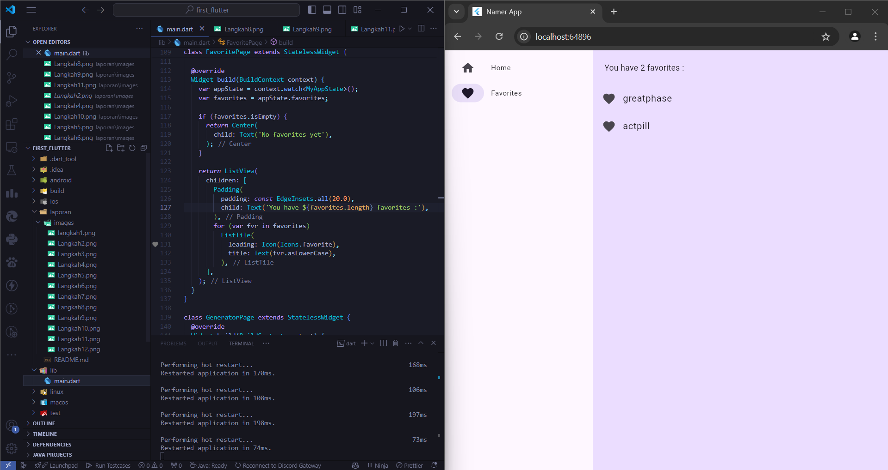

## Pemrograman Mobile - Pertemuan 5

| Nama  | Maulidin Zakaria |
| ----- | ---------------- |
| NIM   | 2241720160       |
| No    | 16               |
| Kelas | TI-3G            |

## First Flutter Project :

### Langkah 1 : Tambahkan packages / dependencies pada file pubspec.yaml yang nantinya akan digunakan pada project flutter ini

### Langkah 2 : Tambahkan rules pada file analysis_options.yaml

### Langkah 3 : Modifikasi kode pada file main untuk dapat menampilkan kata random pada tampilan.

### Langkah 4 : Tambahkan button di bawah text random

### Langkah 5 : Tambahkan fungsi getNext() pada class MyAppState untuk dapat mengganti kata random yang sudah digenerate sebelumnya.

### Langkah 6 : Buat refactor pada widget card / teks

### Langkah 7 : Modifikasi widget card tersebut

### Langkah 8 : Tambahkan colortheme dan texttheme pada card tersebut

### Langkah 9 : Tambahkan button baru untuk dapat memberikan like

### Langkah 10 : Buat sidebar dengan menggunakan widget NavigationRail()

### Langkah 11 : Buat variable selectedIndex agar digunakan untuk indexing halaman maupun navigation

### Langkah 12 : Tambahkan responsif pada sidebar dengan menggunakan extended (true)

### Langkah 13 : Buat halaman favorite untuk menyimpan kata yang disukai.

